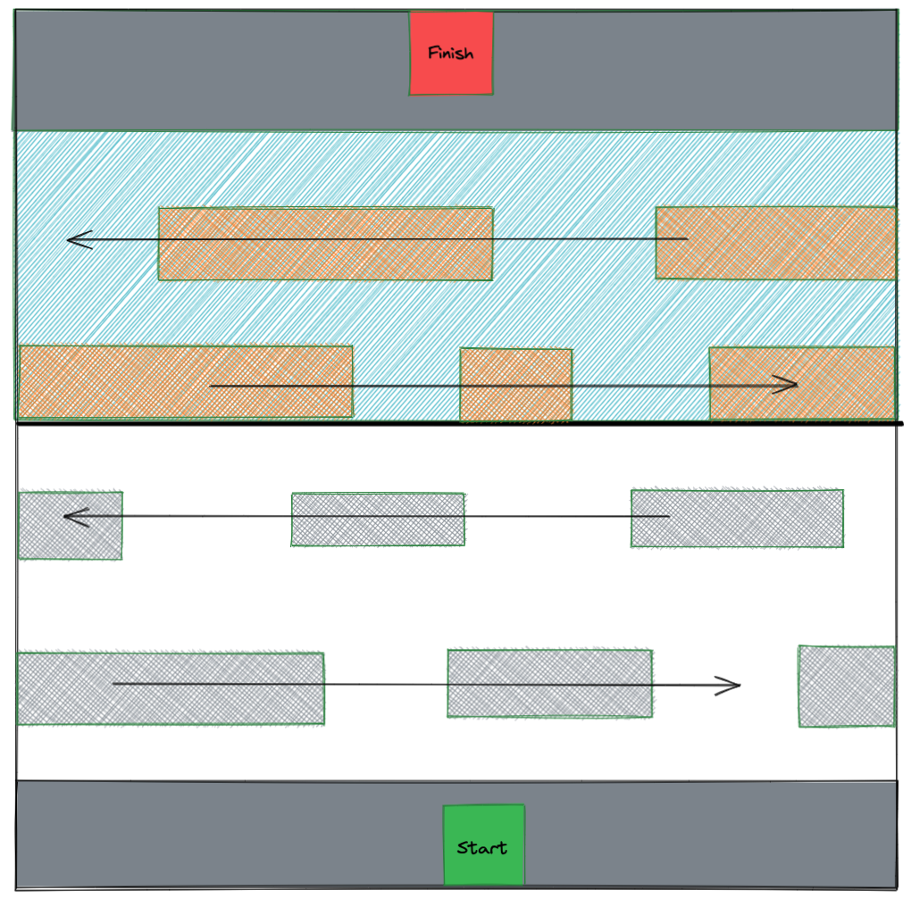
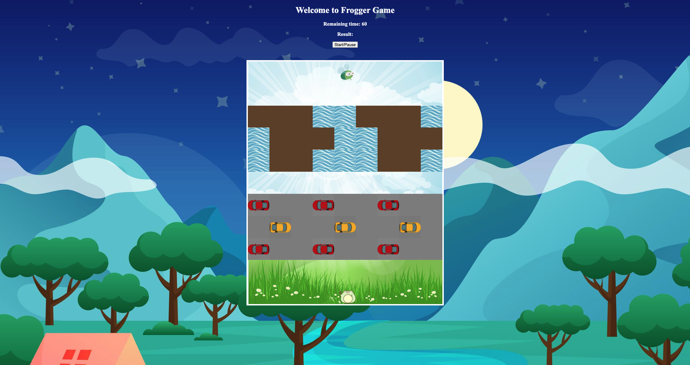

# Froggie's Hungry for Fly

My game is based off of the 1981 Frogger developed by Konami. The objective of the game is to direct the frog to its food (fly) by corssing the busy street and rapid river. The game is built using HTML, CSS, and Javascript.

You can play my version of the Frogger game [here.](https://s9001848.github.io/Project-1-Frogger-Game/)

## Wireframe

Below image is the wireframe I created before making my game. The whole concept is simple and easy to understand. I created my starting and ending blocks first, and created my obstacles with the directions they will be going towards.

## HTML

HTML is my basic structure for my game where I used the div tag as my individual block to form my 11 x 9 game board. I separated my div into 4 main sections; starting block, ending block, carss, and logs. I then gave each section a unique class name like the images below. 

## CSS

My CSS page is fairly simple, I gave my starting and ending block a background image. I also styled my street and road as background color so my frog can be shown as it is trying to cross to the other side. My obstacles was given a background image since the frog will not be standing on top of it.  

## Javascript

My Javascript consists of 7 major sections; global variables, character movements, movements of the logs and cars, winning conditions, and timer. The spent the most time on figure out how I can move my cars block by block.

## Requirements

The requirements needed for this project to be successful:

- A result that show the winning condition.
- Able to display the game in the browser.
- Include separate HTML / CSS / Javascript files,
- Use Javascript for DOM manipulation.
- Deploy your game online to public.
- Use semantic markup for HTML and CSS.

## How the Game Works:

1. Use the arrow keys to control the movements of the frog.
2. Your goal is to get to the other side and eat the fly.
3. You will need to dodge the obstacles coming towards you in order to get to the fly. 

## Finshed Game

